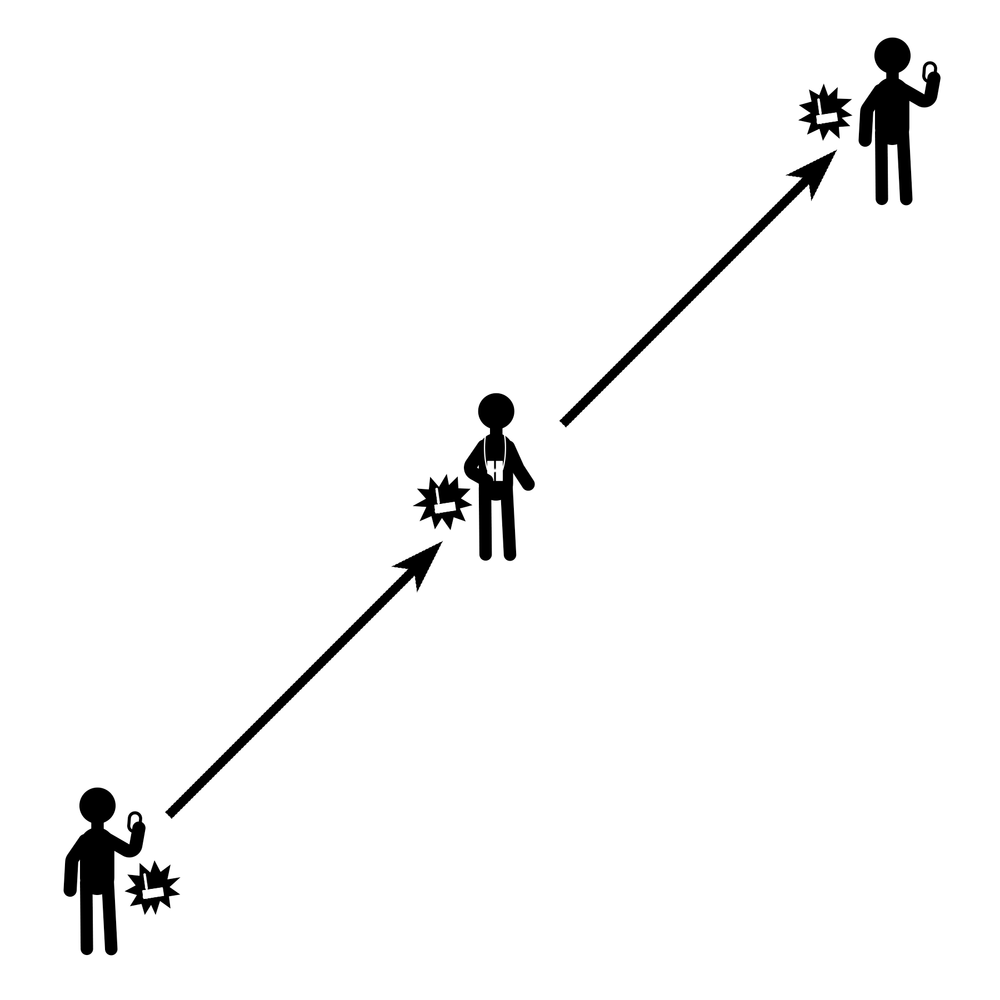
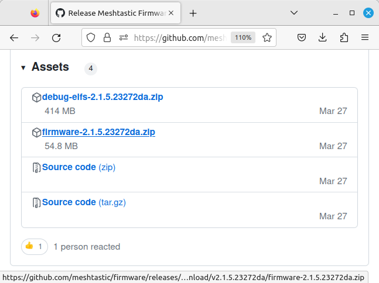
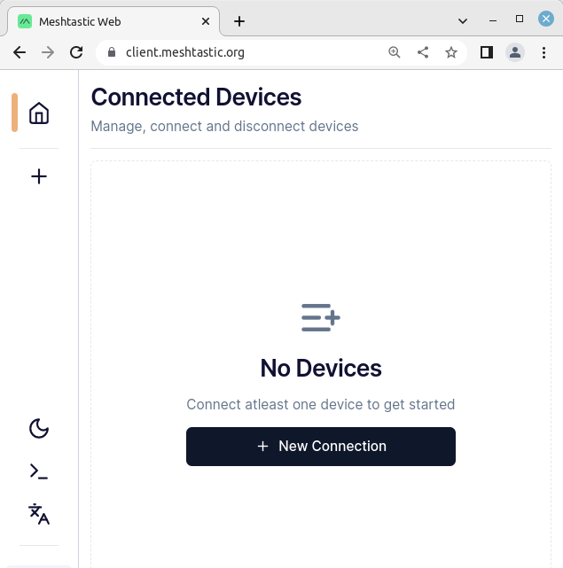

LoRa + Meshtastic: Encrypted messaging from your phone without the
internet

July 2023

**Iffy Books + Mike Dank**

**\
**The Meshastic project, founded in early 2020, uses inexpensive LoRa
radios to create an off-grid mesh network for communication. If you've
ever been hiking or camping in the wilderness away from cell towers, or
at locations like music festivals where infrastructure is often
congested from a high volume of use, you may understand the need for a
platform that doesn\'t rely on traditional communication services.

Meshtastic is completely off-grid, and doesn't rely on any existing
networks or infrastructure. It does so using LoRa (short for **Lo**ng
**Ra**nge) radios that are advertised as being able to transmit data at
a typical range of 10km (\~6 miles) in areas with a clear line of sight,
and some have reported communicating over longer distances. In a city
environment with many obstructions, your range is more likely to be 1--3
blocks.

LoRa implements chirp spread spectrum (CSS) modulation, meaning that it
is robust to channel noise and resistant to multi-path fading, resulting
in low interference.

It is important to note that LoRa is not designed for high-speed data
transmission, and the hardware is only capable of transmitting between
250 bits/s and 27 kbits/s. At this speed, LoRa is ideal for text
communication via realtime chat as well as location beaconing, though it
has also been adopted for use in IoT and sensor networks.

Meshtastic uses LoRa technology to provide a communication platform
ideal for small groups of people who wish to have private conversations.
This can be ideal for a temporary setup where there is no traditional
infrastructure to use, or a permanent setup with fixed and mobile nodes
operating in a particular neighborhood.

[]{#anchor}**BUILDING A MESH**

Each node in a Meshastic network is composed of a LoRa radio device,
typically paired via Bluetooth to a mobile phone. Once paired, the host
device can run the Meshtastic application to send and receive messages
on the network.

Each node in the Meshtastic network additionally acts as a relay for
other nodes. For example, if Alice and Bob want to send messages to one
another, but are physically too far apart to make a connection, their
data can automatically be routed through a third user, Carlos, who is
physically between and in range of both Alice and Bob. This means that
even the most distant nodes on the network have the ability to
communicate with all other nodes, even if they are not nearby. As long
as Alice and Bob are using a private encryption key, Carlos won\'t be
able to read their messages.

> {width="4.1547in"
> height="4.1547in"}

Nodes can also be set up as standalone repeaters that simply route
traffic through the network without being connected to a host device.
This allows nodes to be operated in an isolated or otherwise fixed
position, supplying connection to the greater network for others nearby.
This can be an ideal configuration for solar-powered nodes that are
elevated for line-of-sight connection, requiring little to no
maintenance from the operator.

[]{#anchor-1}**PRIVACY**

By default, a new Meshtastic node is configured to use a general chat
channel that everyone has access to. That makes it easy to get started,
but it means your messages can be read by any other Meshtastic user.

To keep your messages secure, you can create a new channel using a
custom AES-256 encryption key. As long as you and your friends keep the
key private (which means not posting it online), no one else will be
able to decipher your chat.

If you want, Meshtastic can share your current GPS coordinates with
everyone else on the channel you\'re using. Sharing your location can be
helpful if you\'re in a remote area or navigating a large crowd. If
you\'re using Meshtastic from home, we recommend turning off GPS
sharing.

[]{#anchor-2}**SUPPLIES**

Setting up a Meshtastic node is relatively inexpensive, assuming you
already have a computer you can use to interact with the radio. You may
want to get materials for two nodes so you can test an end-to-end
connection.

Currently, there are Meshtastic applications for both Android and iOS,
though the iOS application is in beta. Alternatively, there is a
Meshtastic-python library you can use to interface with a LoRa radio via
PC, but you will likely need some prior Python language experience to
make full use of it. Further, there is a serial interface and web
interfaces to access Methtastic from a browser, though the latter may
currently be unstable. There is no current turnkey application for PC
use.

When you purchase your board, make sure to get one that operates in a
frequency you are allowed to transmit on in the country you are
operating in. In the United States we\'re using 915MHz.

[]{#anchor-3}**HELTEC LORA32 SETUP**

Your LoRa radio comes with an antenna, which you\'ll want to connect
before going further. If you power on your LoRa radio without an antenna
attached, you may damage the circuitry.

{width="2.5811in"
height="1.8835in"}

If you\'re using a Heltec LoRa32, your antenna uses an IPEX-1 connector.
The port you\'ll connect it to is on the front of the device, to the
right of the LCD screen.

❏ Line up your antenna\'s IPEX-1 connector with the port side on your
LoRa32 and press it on with your thumb. It may take more pressure than
you expect.

> {width="2.4902in"
> height="2.0016in"}

> []{#anchor-4}**INSTALL PYTHON AND PIP**

Before you flash the Meshtastic firmware to your LoRa device you\'ll
need **Python 3** and the **pip** package manager. To check whether you
have them, first open a terminal window. (If you\'re using macOS, open
the Terminal app. In Windows you can use PowerShell.)

❏ Type the following command and press enter:

> python3 -m pip -V

If Python 3 and pip are installed, you\'ll see a version number for
both. If you get an error message, you\'ll need to install them.

> []{#anchor-5}**Install Python 3 with pip on\
> Debian-based Linux**

❏ Open a terminal window and run the following commands to install
**Python 3** and the **pip** package manager:

> sudo apt-get update

> sudo apt-get install python3

> sudo apt-get install python3-pip

> python3 -m pip install -U pip

↳ If Python and pip are already installed, you can run the following
command to update them:

> sudo apt-get update

> sudo apt-get upgrade

> python3 -m pip install **\--upgrade** pip

> []{#anchor-6}**Install Python 3 with pip on macOS**

❏ Go to this page and follow the instructions to install **Python 3** on
macOS:

> [*https://docs.python-guide.org/starting/install3/osx*](https://docs.python-guide.org/starting/install3/osx)

❏ Once Python is installed, run this command to upgrade the **pip**
package manager:

> python3 -m pip install **\--upgrade** pip

> []{#anchor-7}**Install Python 3 with pip on Windows**

❏ You may want to install **Git Bash**, which will let you run
Linux-like commands instead of using PowerShell. (This is optional.)
Here\'s the download page:

https://git-scm.com/downloads

❏ Go to the following URL and follow the instructions to install
**Python 3** on Windows:

[*https://realpython.com/installing-python/#how-to-install-python-on-windows*](https://realpython.com/installing-python/#how-to-install-python-on-windows)

❏ Once Python is installed, run this command to upgrade the **pip**
package manager:

> python3 -m pip install **\--upgrade** pip

> []{#anchor-8}**INSTALL ESPTOOL**

❏ Next you\'ll run the following command in a terminal window to install
the **esptool** Python package. The same command should work for Linux,
macOS, and Windows.

> **python3 -m pip install \--upgrade esptool**

> []{#anchor-9}**INSTALL HELTEC LORA32 DRIVER**

❏ Go to the following URL and download the Arduino IDE:

[*https://arduino.cc/en/software*](https://arduino.cc/en/software)

❏ Follow the following page and follow the instructions under **Use
Arduino Library Manager**:

[*https://github.com/HelTecAutomation/Heltec_ESP32*](https://github.com/HelTecAutomation/Heltec_ESP32)

> []{#anchor-10}**INSTALL USB SERIAL DRIVER\
> (WINDOWS ONLY)**

❏ Go to the following URL:

[*https://www.silabs.com/developers/usb-to-uart-bridge-vcp-drivers?tab=downloads*](https://www.silabs.com/developers/usb-to-uart-bridge-vcp-drivers?tab=downloads)

❏ Click **CP210x Windows Drivers** to download a **.zip** file
containing the driver.

❏ Extract the **.zip** file you just downloaded and install the driver.

> []{#anchor-11}**ENABLE SERIAL ACCESS (LINUX ONLY)**

❏ Plug your LoRa32 into your computer and run the following command to
get the local name of the device:

ls /dev/ttyUSB\*

You should see something like \"/dev/ttyUSB0\".

↳ If more than one USB device comes up, unplug your device, run the
command again, and look for the difference.

↳ If you don\'t see the USB device, try running the following command to
uninstall brltty. It's a program for interfacing with braille displays
that can cause problems with USB serial connections.

> sudo apt-get autoremove brltty

❏ You\'ll most likely need to run the following command to allow serial
port access. You\'ll need to do this every time you connect your LoRa32
to your computer.

> sudo chmod a+rw /dev/ttyUSB0

[]{#anchor-12}**FLASH MESHTASTIC FIRMWARE\
TO LORA RADIO**

❏ Go to the following URL to find the latest Meshtastic firmware
releases:

> [*https://github.com/meshtastic/firmware/releases*](https://github.com/meshtastic/firmware/releases)

❏ Scroll down until you find the latest release with **Beta** in the
title. In the image below, it\'s **Meshtastic Firmware 2.1.5.23272da
Beta**. Click on the title of the release.

> {width="4.311in"
> height="2.6272in"}

❏ Scroll down and look for a link to a **.zip** file with \"firmware\"
at the beginning of the filename (**firmware-2.1.5.23272da.zip** in the
example below). Click the filename to download the firmware release.

> {width="3.4043in"
> height="2.5437in"}

❏ Find the **.zip** file you just downloaded. Right-click it and extract
to the current directory.

> {width="4in"
> height="2.1626in"}

❏ Open a terminal window and type **cd** followed by a space. Click on
the firmware directory you just created and drag it onto the terminal
window.

> {width="3.7in"
> height="1.7272in"}

❏ The directory\'s full pathname will appear in the terminal window.
Press **enter** to change your working directory to the new firmware
directory.

> {width="3.5in"
> height="1.3299in"}

❏ Type **ls** and press **enter** to see a list of files in the current
directory.

❏ Type the following command in the terminal window, followed by a
space. (Windows PowerShell users should type **./device-install.bat**
instead.)

**./device-install.sh -f **

> {width="4in"
> height="1.1126in"}

❏ Open the firmware directory in File Explorer/Finder and find the file
that starts with **firmware-heltec-v3** and ends with **.bin**. The
filename below is **firmware-heltec-v3-2.1.5.23272da.bin**.

> {width="3.172in"
> height="1.7839in"}

❏ Drag the file into your terminal window to add the path to your
command.

> {width="4.2335in"
> height="0.6945in"}

Here\'s the full command in the example above:

> **./device-install.sh -f
> \'/home/iffybooks/Downloads/firmware-2.1.5.23272da/firmware-heltec-v3-2.1.5.23272da.bin\'**

❏ Press **enter** to run the command and start flashing your LoRa radio.
It may take several minutes to finish.

↳ If something goes wrong, refer to the \"Flashing with the CLI\" page
on the Meshtastic website:

> [*https://meshtastic.org/docs/getting-started/flashing-firmware/esp32/cli-script*](https://meshtastic.org/docs/getting-started/flashing-firmware/esp32/cli-script)

❏ Connect a USB-C cable to your LoRa radio and plug the other end into a
USB power source, such as a computer. You\'ll see the Meshtastic logo on
the LCD screen, followed by a screen that looks like this:

{width="2.339in"
height="1.1953in"}

At the top right of the screen you\'ll see a 4-digit ID code that
identifies your device. In this case the device\'s ID is **b494**.

> []{#anchor-13}

> []{#anchor-14}**INSTALL THE MESHTASTIC APP ON YOUR PHONE**

**iOS:** Search for \"Meshtastic\" in the App Store and\
install it.

**Android:** Go to the Google Play Store or the Amazon Appstore and
search for \"Meshtastic.\" Install the app.

Or download the .apk from GitHub and sideload it:
[*https://github.com/meshtastic/Meshtastic-Android/*](https://github.com/meshtastic/Meshtastic-Android/releases/latest)\
***or***
[*https://iffybooks.net/link/5a11*](https://iffybooks.net/link/5a11)

> []{#anchor-15}**PAIR WITH YOUR LORA RADIO (ANDROID)**

❏ Open the Meshtastic app and tap the **plus sign** (+) in the bottom
right corner to start scanning for LoRa devices.

> {width="2.6in"
> height="1.1701in"}

❏ Find your device using its four-character ID. Tap the radio button
next to it to start pairing.

❏ Check your LoRa device\'s screen and enter the six-digit code. Then
tap **OK**.

{width="2.2811in"
height="1.9752in"}

> []{#anchor-16}**PAIR WITH YOUR LORA RADIO (iOS)**

❏ Tap the **Bluetooth** icon at the bottom of the screen. Find your LoRa
device under **Available Radios** and tap it.

> {width="1.9925in"
> height="3.4583in"}

❏ Check your LoRa device\'s screen and enter the six-digit code. Then
tap **Pair**.

> {width="2.2602in"
> height="2.0193in"}

[]{#anchor-17}**SET YOUR REGION (ANDROID)**

❏ Tap **Region** at the top right of the screen and select your region
from the dropdown menu.

  --------------------------------------------------------------------------------------------- --- ---------------------------------------------------------------------------------------------
  {width="1.9in" height="1.7098in"}   ➡   {width="1.9in" height="1.7291in"}
  --------------------------------------------------------------------------------------------- --- ---------------------------------------------------------------------------------------------

[]{#anchor-18}❏ Tap **Save**, which will reboot your LoRa32.

[]{#anchor-19}

[]{#anchor-20}**SET YOUR REGION (iOS)**

❏ Tap the **Bluetooth** icon.

{width="2.598in"
height="0.8063in"}

❏ Tap **Set LoRa Region**.

{width="2.5in"
height="2.561in"}

❏ Tap **Please set a region** and select your region from the dropdown
menu.

{width="2in"
height="2.6335in"}
{width="2in"
height="2.6311in"}

❏ Tap **Save**, which will reboot your LoRa32.

{width="3in"
height="1.2311in"}

[]{#anchor-21}

[]{#anchor-22}**NAME YOUR LORA RADIO (ANDROID)**

❏ Go to **Settings** and enter a short name and long name for your LoRa
radio (optional). Tap **Send** to save and reboot.

{width="2.6819in"
height="4.3799in"}

[]{#anchor-23}

[]{#anchor-24}**NAME YOUR LORA RADIO (iOS)**

❏ Go to the Meshtastic settings, then tap **User**. Enter a short and
long name for your device. Tap **Save** to save and reboot.

{width="2.7811in"
height="3.8098in"}

[]{#anchor-25}

[]{#anchor-26}**UPDATE LORA RADIO SETTINGS**

The screen captures below are from iOS, but the steps are the same for
Android.

❏ In the Meshtastic app, open **Settings**.

{width="3in"
height="0.7457in"}

❏ *iOS only:* Under **Configure** in the **Settings** window, make sure
your LoRa device is selected. If it isn\'t, select it from the dropdown
menu.

❏ Tap **LoRa** to open the LoRa radio settings.

{width="2.2181in"
height="3.2516in"}

Meshtastic has eight built-in data transmission presets, which determine
the maximum range for transmitting and receiving, as well as how long it
takes to send each message.

It\'s important to note that you and your friends will all need to use
the same transmission preset; if not, you won\'t be able to see each
other\'s messages.

❏ The default preset is called **Long Range / Fast**. Tap the dropdown
menu next to **Presets** to see the other options. For now, leave **Long
Range / Fast** selected.

{width="2.9154in"
height="3.4598in"}

Here\'s a table with details on all the Meshtastic transmission presets:

  ------------------------ ---------------------- --------------------- ------------------ ----------------- --------------- -----------------
  **Channel setting**      **Alt Channel Name**   **Data-Rate**         **SF / Symbols**   **Coding Rate**   **Bandwidth**   **Link Budget**
  Short Range / Fast       Short Fast             6.8 kbps              7 / 128            4/8               250             137dB
  Short Range / Slow       Short Slow             3.9 kbps              8 / 256            4/8               250             140dB
  Medium Range / Fast      Medium Fast            2.2 kbps              9 / 512            4/8               250             143dB
  Medium Range / Slow      Medium Slow            1.2 kbps              10 / 1024          4/8               250             146dB
  Long Range / Fast        Long Fast              0.67 kbps (default)   11 / 2048          4/8               250             148.5dB
  Long Range / Moderate    Long Moderate          0.335 kbps            11 / 2048          4/8               125             151dB
  Long Range / Slow        Long Slow              0.18 kbps             12 / 4096          4/8               125             154dB
  Very Long Range / Slow   Very Long Slow         0.09 kbps             12 / 4096          4/8               62.5            157dB
  ------------------------ ---------------------- --------------------- ------------------ ----------------- --------------- -----------------

*Source (with details on terms & abbreviations in the table above):
https://meshtastic.org/docs/overview/radio-settings*

❏ Scroll down in the LoRa settings and you\'ll see an option called
**Number of hops**. By default, each message you send will make three
hops across the mesh network before nodes stop retransmitting it.
Increasing the number of hops risks overloading the network, so you
should leave it on **3** unless you have a good reason to change it.

{width="2.5354in"
height="1.4339in"}

❏ Keep scrolling down and you\'ll see the **RX Boosted Gain** option,
which makes your LoRa radio more sensitive to weak signals. We\'re
currently recommending you turn it **on**. Then tap **Save**, which will
reboot your device.

[]{#anchor-27}{width="2.5in"
height="1.7055in"}

[]{#anchor-28}

[]{#anchor-29}**SET YOUR DEVICE ROLE**

The screen captures below are from iOS, but the steps are the same for
Android.

❏ In the Meshtastic app, go to **Settings**. Then tap **Device**.

Meshtastic has seven device configuration presets (a.k.a. device roles),
which you can change depending on how you plan to use your Meshtastic
node.

Tap the drop down menu next to **Device Role** to see the options. The
default device role is called **Client**.

{width="2.6417in"
height="4.1984in"}

Here\'s a table with details on each device role:\

+--------------------------------+------------------------------------+
| **Device Configuration Preset\ | **Description**                    |
| (a.k.a. Device Role)**         |                                    |
+--------------------------------+------------------------------------+
| **CLIENT**                     | Client (default) - This role will  |
|                                | follow the standard routing rules  |
| ** **                          | while also allowing the device to  |
|                                | interact with client applications  |
|                                | via BLE/Wi-Fi (Android/Apple/Web). |
+--------------------------------+------------------------------------+
| **CLIENT_MUTE**                | Client Mute - Same as a client     |
|                                | except packets will not hop over   |
| ** **                          | this node, does not contribute to  |
|                                | routing packets for mesh.          |
+--------------------------------+------------------------------------+
| **ROUTER**                     | Router - Mesh packets will prefer  |
|                                | to be routed over this node. The   |
| ** **                          | assumption is that Router-type     |
|                                | devices will be placed in          |
|                                | locations with a                   |
|                                | height/range/antenna advantage,    |
|                                | and therefore have better overall  |
|                                | coverage. This node will not be    |
|                                | used by client apps. The BLE/Wi-Fi |
|                                | radios and the OLED screen will be |
|                                | put to sleep. Please note: Due to  |
|                                | the preferred routing, this role   |
|                                | may cause higher power usage due   |
|                                | to more frequent transmission.     |
+--------------------------------+------------------------------------+
| **ROUTER_CLIENT**              | Router Client - Hybrid of the      |
|                                | Client and Router roles. Similar   |
| ** **                          | to Router, except the Router       |
|                                | Client can be used as both a       |
|                                | Router and an app connected        |
|                                | Client. BLE/Wi-Fi and OLED screen  |
|                                | will not be put to sleep.          |
+--------------------------------+------------------------------------+
| **REPEATER**                   | Repeater - Mesh packets will       |
|                                | prefer to be routed over this      |
| ** **                          | node. This role eliminates         |
|                                | unnecessary overhead such as       |
|                                | NodeInfo, DeviceTelemetry, and any |
|                                | other mesh packet, resulting in    |
|                                | the device not appearing as part   |
|                                | of the network. As such, direct    |
|                                | messaging this node is not         |
|                                | available, as it will not appear   |
|                                | in your nodes list which results   |
|                                | in a cleaner mesh network. Channel |
|                                | and modem settings of the mesh     |
|                                | packets being repeated must be     |
|                                | identical to the repeater\'s       |
|                                | configuration. Please see          |
|                                | Rebroadcast Mode for additional    |
|                                | settings specific to this role.    |
+--------------------------------+------------------------------------+
| **TRACKER**                    | Tracker - For use with devices     |
|                                | intended as a GPS tracker.         |
| ** **                          | Position packets sent from this    |
|                                | device will be higher priority.    |
|                                | Smart Position Broadcast will      |
|                                | default to the currently           |
|                                | configured settings.               |
+--------------------------------+------------------------------------+
| **SENSOR**                     | Sensor - For use with devices      |
|                                | intended to primarily collect      |
| ** **                          | sensor readings. Telemetry packets |
|                                | sent from this device will be      |
|                                | higher priority, broadcasting      |
|                                | every five minutes.                |
+--------------------------------+------------------------------------+

*Source: https://meshtastic.org/docs/settings/config/device*\

❏ Select the device role you\'d like to use, such as **Router &
Client**, or leave it on the default **Client**.

❏ If you\'ve changed your device role, tap **Save**. Your device will
reboot.

[]{#anchor-30}**MAKE SURE GPS LOCATION SHARING IS TURNED OFF**

The screen captures below are from iOS, but the steps are the same for
Android.

❏ Open **Settings**.

{width="3in"
height="0.7457in"}

❏ Tap **App Settings**. If the option **Provide location to mesh** is
selected, deselect it.

{width="2.5in"
height="2.3937in"}

❏ *iOS only: *Go to **Settings** in iOS, scroll down, and tap
**Meshtastic**. Then make sure Location sharing is set to **Never**.

{width="2.4217in"
height="2.6866in"}

While you\'re here, tap on **Siri & Search**. To avoid leaking data
needlessly, deselect **Learn from this App** and **Show Content in
Search**.

{width="2.5252in"
height="2.7835in"}

[]{#anchor-31}**READ MORE ABOUT DEVICE\
CONFIG OPTIONS**

❏ Go to the following URL to read more about the config options for
Meshtastic:

[*https://meshtastic.org/docs/settings/config*](https://meshtastic.org/docs/settings/config)

[]{#anchor-32}**SEND A MESSAGE TO THE GROUP CHAT**

❏ Tap the **Messages** icon.

{width="2in"
height="0.6165in"}
{width="2in"
height="0.6299in"}

❏ Then tap the icon for **channel 0**, which will take you to the
primary channel (a.k.a. the group chat).

{width="2in"
height="1.4283in"}
{width="2in"
height="1.5154in"}

❏ Type a message and tap the **Send** button.

{width="2.4791in"
height="2.9854in"}

If your message is received and acknowledged, on Android you\'ll see a
check mark appear in the cloud icon under your message. In the iOS app
you\'ll see the word \"Acknowledged\" appear under the message.

{width="1.4937in"
height="1.2811in"}
{width="1.502in"
height="1.2709in"}

[]{#anchor-33}

[]{#anchor-34}**SEND A DIRECT MESSAGE**

Once you\'ve connected with someone in the primary channel, you can send
a direct message (DM).

❏ Tap the **Messages** icon. Under **Direct Messages**, tap the device
you want to DM.

{width="2in"
height="2.1272in"}

❏ Type a message and tap **Send**.

{width="2.5in"
height="1.7035in"}

You\'re texting without the internet or cell network! Pretty neat!

{width="2.5in"
height="4.3398in"}

It\'s important to note that Meshtastic DMs are encrypted using the same
shared key as the group chat. That means anyone else on the channel can
(in theory) read your messages.

If you want to chat privately with a friend, create a new shared
encryption key and don\'t reveal it to anyone else. (Details in the next
section.)

[]{#anchor-35}

[]{#anchor-36}**CREATE A NEW PRIVATE KEY**

When you first set up Meshtastic, your messages are encrypted using a
weak default key, which is widely known. Many Meshtastic users stick
with the default key because they aren\'t concerned with privacy. To
chat privately, you\'ll need to generate a new encryption key and share
it with the person/people you\'re planning to chat with.

We recommend against creating and updating encryption keys using the iOS
and Android apps. We\'ve gotten unexpected results during testing, and
it isn\'t worth the hassle.

Instead, we\'ll generate an encryption key using the command line. Then
we\'ll use the Meshtastic Web Client to update the settings on your LoRa
device.

❏ Meshtastic uses AES-256 encryption, so you\'ll need a 256-bit key in
Base64 format. To generate one, open a terminal window and run the
following command. (To type the pipe character, hold shift and press
backslash.)

> **cat /dev/urandom \| head -c 32 \| base64**

The command above generates 32 bytes of random characters (equivalent to
256 bits), then converts it to the Base64 encoding format. The output
will look something like this:

**dqP9LPdBkE/bF5lsYCwsXfnNavx3Ikl5LsUoCu91F/4=**

❏ Highlight your new key in the terminal window, then right-click and
select **Copy**. Now you can share the key with your friends!

*Note: When distributing your shared encryption key with friends, it\'s
best to use an encrypted channel such as Signal. Or post the key on
CryptPad.fr and share the link via Signal.*

[]{#anchor-37}**LAUNCH THE MESHTASTIC WEB CLIENT**

The quickest way to update your Meshtastic settings from a computer is
to use the Meshtastic Web Client. Unfortunately you\'ll need to use a
Chromium-based browser, such as Google Chrome. If you don\'t already
have it, you can download it here:

[*https://www.google.com/chrome*](https://www.google.com/chrome)

❏ Connect your LoRa device to your computer with a USB-C cable that
supports data.

❏ Open Chrome and go to the following URL:

[*https://client.meshtastic.org*](https://client.meshtastic.org)

❏ Click **New Connection**.

{width="3.7043in"
height="3.7453in"}

❏ At the top of the **Connect New Device** window, click the **Serial**
tab.

> {width="3.2681in"
> height="0.9709in"}

❏ Click the **New device** button.

> {width="4.3028in"
> height="2.902in"}

❏ You\'ll see a prompt that reads \"client.meshtastic.org wants to
connect to a serial port.\" Scroll through the list and look for the USB
serial port that corresponds to your LoRa device. Click the port to
highlight, then click **Connect**.

> {width="2.7362in"
> height="2.5898in"}

In the example above, the port is called **ttyUSB0**.

❏ You\'ll see a new rectangular button at the top of the window. Click
on it to connect to your LoRa device.

> {width="2.9783in"
> height="1.9638in"}

❏ Click **X** to close the **Connect New Device** window.

[]{#anchor-38}

[]{#anchor-39}**UPDATE YOUR SHARED ENCRYPTION KEY**

❏ In the **Navigation** column, click on **Channels**.

{width="4.4681in"
height="2.3083in"}

Let\'s keep using the default key on the primary channel and add a
shared key on channel 1.

❏ Click the **Ch 1** tab to switch to channel 1. Highlight the text in
the **pre-Shared Key** field and delete it, then paste in your new
shared key.

{width="4.5362in"
height="2.2681in"}

❏ Scroll down and give your channel a name (optional). When you\'re
done, click **Submit** and your device will reboot.

> {width="3.75in"
> height="2.1083in"}

❏ Go to **Messages** and you\'ll see your new channel.

> {width="1.8484in"
> height="3.2173in"}

**INSTALL THE MESHTASTIC CLI**

❏ Open a terminal window and run the following commands to install the
Meshtastic CLI (command-line interface). The same commands should work
for Linux, macOS, and Windows.

> **python3 -m pip install \--upgrade pytap2**

> **python3 -m pip install \--upgrade meshtastic**

❏ Run the following command to see if the CLI is installed properly. You
should see a list of options.

> **meshtastic \--help**

↳ If the command above doesn\'t work, you\'ll need to add the meshtastic
application file to your PATH environment variable. If you\'re using
Linux, you can do that by modifying your **\~/.profile** file. (On macOS
it\'ll be **\~/.bash** instead.)

First, find the **meshtastic** application file. Here\'s where it\'s
located in Linux Mint:

**/home/iffybooks/.local/bin/meshtastic**

Run the following command to open **\~/.profile** using the **nano**
text editor.

**sudo nano \~/.profile**

Create a new line at the end of the file and type the following line,
swapping in the path to your **meshtastic** application file:

**export PATH=\"/home/iffybooks/.local/bin:\$PATH\"**

❏ Press **ctrl+o** to save the file. You\'ll be prompted to check the
filename. Press **enter**.

❏ Close your terminal window and open a new one.

❏ Run the following command and you should see a list of options for the
Meshtastic CLI:

meshtastic \--help

> []{#anchor-40}**GET A LIST OF MESHTASTIC NODES**

❏ Run the following command to see a list of Meshtastic nodes on the
network:

**meshtastic \--nodes**

> []{#anchor-41}**SEND A MESSAGE FROM THE\
> COMMAND LINE**

❏ Connect your LoRa radio to your computer with a USB cable and run the
following command to send a message to the primary channel:

> **meshtastic \--sendtext \"Hello out there\\!\"**

[]{#anchor-42}**SEND A MESSAGE EVERY 10 MINUTES**

Here\'s a brief shell script you can use to send the same message every
10 minutes (600 seconds):

> **while :**

> **do**

> ** meshtastic \--sendtext \"Hello out there\\!\"**

> ** sleep 600**

> **done**

> []{#anchor-43}**LEARN MORE ABOUT THE MESHTASTIC BROADCAST ALGORITHM**

You can learn more about Meshtastic\'s broadcast algorithm here:

[*https://meshtastic.org/docs/overview/mesh-algo*](https://meshtastic.org/docs/overview/mesh-algo)

** **

** **

{width="2.339in"
height="1.7189in"}

**319 N. 11th St. #2I, PHL**

**iffybooks.net\
**

**(Last updated 7/7/23)**
